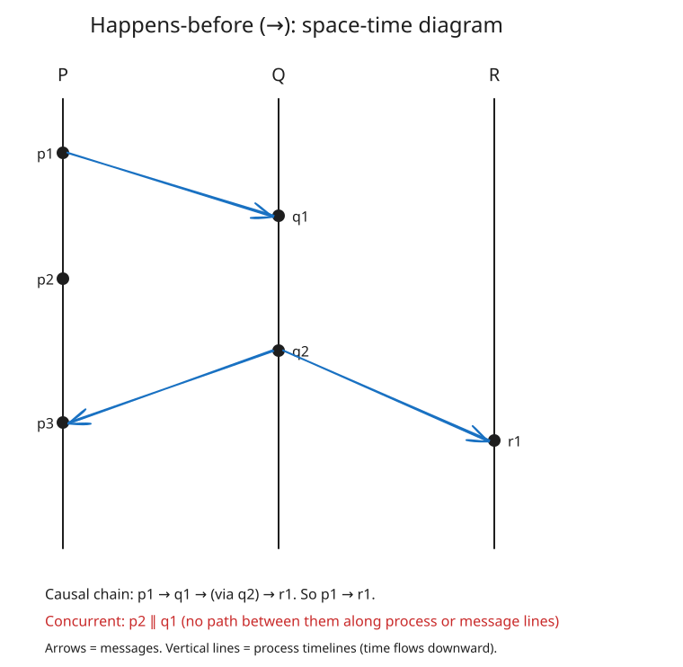
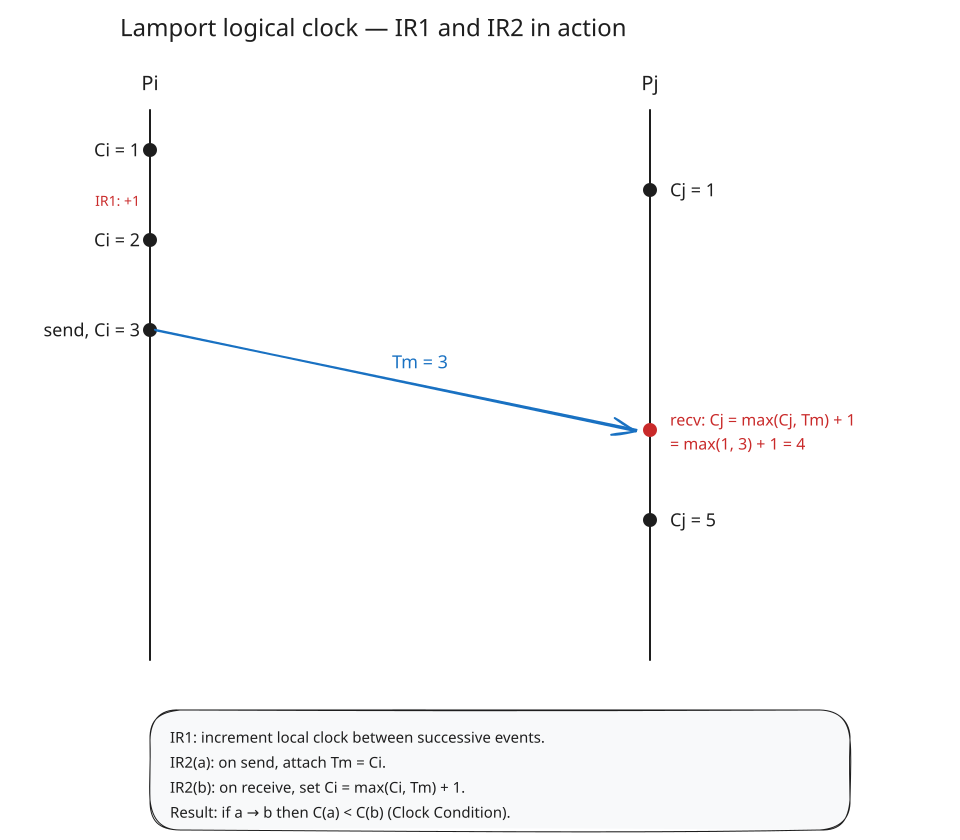
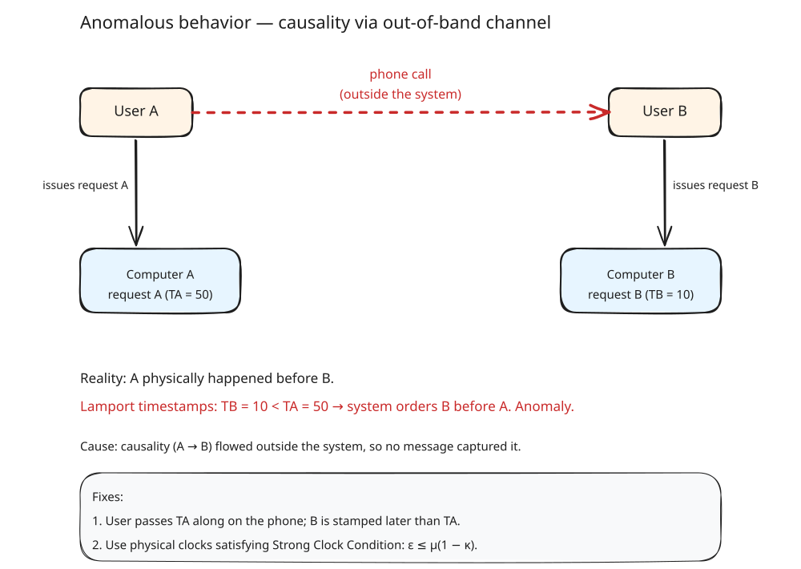

# Summary: Time, Clocks, and the Ordering of Events in a Distributed System (Lamport, 1978)

Summary of Leslie Lamport's 1978 paper ([PDF](https://lamport.azurewebsites.net/pubs/time-clocks.pdf)). The paper reframes event ordering in distributed systems around *causality* rather than wall-clock time, introduces logical clocks, and shows how to extend the resulting partial order to a total order usable for synchronization. It then discusses why physical clocks are still needed to match user-perceived ordering, and bounds how closely a set of drifting clocks can be synchronized.

---

## 1. The system model

- A distributed system is a collection of spatially separated processes communicating only by messages.
- A system is *distributed* if message transmission delay is not negligible compared to the time between events within a process.
- Each process is a sequence of events. An event can be a local action, sending a message, or receiving a message.
- You cannot meaningfully rely on physical time to order events across processes, because clocks are imperfect and observers are separated.

---

## 2. The "happens before" relation → (partial order)

Lamport defines `a → b` ("a happens before b") as the smallest relation such that:

1. If `a` and `b` are in the same process and `a` occurs before `b`, then `a → b`.
2. If `a` is the sending of a message by one process and `b` is the receipt of that same message by another, then `a → b`.
3. Transitive: if `a → b` and `b → c` then `a → c`.

Two events `a` and `b` are **concurrent** if neither `a → b` nor `b → a`.

Interpretation: `a → b` means it is *possible* for `a` to have causally affected `b`. Concurrent events cannot causally affect each other. Because not all pairs of events are related, `→` is only a **partial order**.



The space-time diagram: dots are events, vertical lines are processes, wavy lines are messages. `a → b` iff you can get from `a` to `b` by moving forward along process lines and message lines.

---

## 3. Logical clocks

A clock `Ci` for process `Pi` is just a function assigning a number `Ci⟨a⟩` to each event `a` in `Pi`. No assumption is made yet about physical time — logical clocks can be simple counters.

**Clock Condition** — the correctness criterion for logical clocks:

> For any events `a`, `b`: if `a → b` then `C⟨a⟩ < C⟨b⟩`.

Note the converse is *not* required — concurrent events may get the same or different timestamps.

The Clock Condition holds iff two sub-conditions are satisfied:

- **C1**: If `a` precedes `b` within process `Pi`, then `Ci⟨a⟩ < Ci⟨b⟩`.
- **C2**: If `a` is a send by `Pi` and `b` is the matching receive by `Pj`, then `Ci⟨a⟩ < Cj⟨b⟩`.

These are enforced by two simple **implementation rules**:

- **IR1**: `Pi` increments `Ci` between any two successive events.
- **IR2**:
  - (a) When `Pi` sends a message `m`, it stamps it with `Tm = Ci`.
  - (b) When `Pj` receives `m`, it sets `Cj := max(Cj, Tm) + 1`, and the receive event is timestamped after that update.

This is what is now universally called a **Lamport timestamp**.



---

## 4. Extending to a total order ⇒

The Clock Condition only gives a partial order because two events in different processes can end up with equal logical times. Break ties using an arbitrary but fixed total order `≺` on process IDs.

Define `a ⇒ b` iff:

- `Ci⟨a⟩ < Cj⟨b⟩`, **or**
- `Ci⟨a⟩ = Cj⟨b⟩` **and** `Pi ≺ Pj`.

Properties of `⇒`:
- It is a total order.
- It is consistent with `→`: if `a → b` then `a ⇒ b`.
- It is *not unique* — depends on the chosen process order and how clocks were advanced. Any such ordering is a valid serialization.

---

## 5. Distributed mutual exclusion (worked example)

To illustrate that a total order is enough to build a real distributed algorithm, Lamport solves mutual exclusion over a fixed set of processes sharing a single resource. There is no central coordinator — every process must decide locally when it's safe to take the resource.

### Why a central scheduler doesn't work

Suppose P0 is a central scheduling process. P1 sends a request to P0 and then sends a message to P2. Upon receiving that message, P2 sends its own request to P0. It is possible for P2's request to reach P0 before P1's, even though P1's request *causally precedes* P2's (P1 → P2 via the message chain). A central scheduler only sees arrival order, not causal order — so it would violate the ordering requirement.

### Setup

**Assumptions** (simplifying, not fundamental):
- Any two processes can exchange messages.
- Messages between a given pair are received in the order sent (FIFO channels).
- Every message is eventually received.
- No failures.
- The resource is initially granted to exactly one process.

**Correctness goals**:
- **I (Safety)**: A grant must be released before another grant. No two processes hold it simultaneously.
- **II (Ordering)**: Requests are granted in the order they are *made* (according to `⇒`). Concurrent requests can go in any order.
- **III (Liveness)**: Every request is eventually granted (assuming holders eventually release).

**Local state**: each process maintains its own request queue, never seen by any other process, sorted by the total order `⇒` (Lamport timestamp, then process-ID tiebreak).

### The five rules

**Rule 1 — Requesting**: To request the resource, `Pi` sends `request Tm:Pi` to every other process and enqueues it locally. So `Pi` does two things: broadcasts the request AND adds it to its own queue.

**Rule 2 — Receiving a request**: When `Pj` receives `request Tm:Pi`, it enqueues it and sends back a timestamped ack to `Pi`. The ack tells `Pi` "I know about your request, and here's my current clock value."

**Rule 3 — Releasing**: To release, `Pi` removes its own request from its queue and broadcasts a timestamped `release` to every other process.

**Rule 4 — Receiving a release**: When `Pj` receives a `Pi releases resource` message, it removes the matching `Pi` request from its queue.

**Rule 5 — Granting (the key rule)**: `Pi` is granted the resource when **both**:
- (i) its own request is the earliest in its queue under `⇒`, **and**
- (ii) it has received a message with a larger timestamp from *every* other process.

Both conditions are tested purely from local state.

### Why condition (ii) is the clever part

Condition (i) alone isn't enough. `Pi` might see its own request at the head of its queue, but some other process `Pk` might have sent a request with an even earlier timestamp that just hasn't arrived yet.

Condition (ii) closes this gap: once `Pi` has received *any* message from every other process with a timestamp greater than `Tm`, it knows — thanks to FIFO channels — that no request with timestamp ≤ `Tm` from that process can still be in transit. If such a request existed, it would have been sent before the later-timestamped message, and FIFO guarantees it would have arrived first.

So condition (ii) means: "I've heard from everyone, and nobody has a pending request that could beat mine."

### Concrete example

Three processes: P1, P2, P3. Resource starts with P1.

```
Time    P1                  P2                  P3
────────────────────────────────────────────────────────
t=1     holds resource
t=5                         wants resource
                            sends req(5:P2) to P1, P3
                            enqueues (5:P2)
t=6                                             wants resource
                                                sends req(6:P3) to P1, P2
                                                enqueues (6:P3)
t=7     receives req(5:P2)
        enqueues (5:P2)
        sends ack(7:P1) to P2
t=8     receives req(6:P3)
        enqueues (6:P3)
        sends ack(8:P1) to P3
t=9                         receives req(6:P3)
                            enqueues (6:P3)
                            sends ack(9:P2) to P3
t=10                                            receives req(5:P2)
                                                enqueues (5:P2)
                                                sends ack(10:P3) to P2
t=11    releases resource
        removes own entry
        sends release(11:P1) to P2, P3
t=12                        receives release(11:P1)
                            removes P1's initial entry
                            receives ack(8:P1)  [or earlier]
                            receives ack(10:P3)
                            → queue: [(5:P2), (6:P3)]
                            → (i) own request at head ✓
                            → (ii) heard from P1 (ts=11>5) ✓
                                   heard from P3 (ts=10>5) ✓
                            → GRANTED ✓
t=13                                            receives release(11:P1)
                                                removes P1's initial entry
                                                → queue: [(5:P2), (6:P3)]
                                                → (i) P2's request at head,
                                                       not own → waits
```

P2 gets the resource because its request (5:P2) is at the head of its queue (5 < 6), and it has received messages from both P1 and P3 with timestamps > 5. P3 must wait — even though P3 has both requests in its queue, P2's request is ahead of P3's under `⇒`. P3 gets the resource only after P2 releases and P3 removes (5:P2) from its queue.

### Why each correctness condition holds

**Condition I (safety)**: Rules 3 and 4 are the only ones that delete messages from the request queue. Two processes can't both see themselves at the head of the queue simultaneously — the total order `⇒` is the same everywhere, so they agree on who's first.

**Condition II (ordering)**: The total ordering `⇒` extends the partial ordering `→`. If request A causally precedes request B, then A has a lower position in `⇒`, so A is always at the head of the queue before B.

**Condition III (liveness)**: Rule 2 guarantees that after `Pi` requests the resource, condition (ii) of rule 5 will eventually hold. Rules 3 and 4 imply that if each process which is granted the resource eventually releases it, then condition (i) of rule 5 will eventually hold.

### Generalization — state machine replication

This is a fully distributed algorithm — each process independently follows these rules, with no central synchronizing process or central storage. The approach generalizes: model your system as a deterministic state machine, totally order all commands using `⇒`, and have every replica execute them in that order. Each process independently simulates the state machine using the same sequence of commands. The mutual-exclusion protocol is just one instance of this general technique.

This is the foundational idea behind **replicated state machines** — the same concept that underpins Paxos, Raft, ZAB, and virtually all consensus protocols that came later.

### Cost and limitation

The algorithm requires **3(N−1) messages per critical section** (N−1 requests + N−1 acks + N−1 releases). Every process must participate in every request. The failure of a single process makes it impossible for any other process to execute state machine commands, halting the system.

As Lamport notes: without physical time, there is no way to distinguish a failed process from one which is just pausing between events. A user can tell that a system has "crashed" only because they have been waiting too long for a response. Handling failures requires physical time — which is exactly what the rest of the paper addresses.

---

## 6. Anomalous behavior

The logical clock only captures causality *inside the system*. If information flows outside the system — the classic example is a user on computer A picking up the phone, calling a friend, who then issues a request on computer B — B's request can get a *lower* timestamp than A's, even though A physically happened first. The system has no way of knowing about the phone call.



Two possible fixes:

1. **Explicit**: make the user propagate the ordering info. When the friend issues request B, they supply `TA` so B is stamped with a larger timestamp. The *user* is responsible for avoiding anomalies.
2. **Physical clocks**: build a system of clocks that satisfy a stronger condition.

**Strong Clock Condition**: for any events `a`, `b` (including physically external events), if `a` physically happened before `b`, then `C⟨a⟩ < C⟨b⟩`.

Logical clocks alone cannot satisfy this. You need clocks that approximate real time.

---

## 7. Physical clocks and the synchronization bound

Let `Ci(t)` be the reading of `Pi`'s physical clock at real time `t`. Lamport requires:

- **PC1** (drift bound): `|dCi(t)/dt − 1| < κ` for some small `κ`. For typical crystal clocks, `κ ≤ 10⁻⁶`.
- **PC2** (skew bound): `|Ci(t) − Cj(t)| < ε` for all `i, j`, `t`.

Let `μ` be the shortest real-time message transmission delay between any two processes (at minimum, the distance between processes divided by the speed of light).

The Strong Clock Condition (hence no anomalies) holds provided:

$$\varepsilon \; \leq \; \mu (1 - \kappa)$$

Intuitively: clocks must be synchronized to within less than the fastest possible message delay, so a receive always reads later than the corresponding send.

**Synchronization algorithm** (adapted IR1/IR2 for physical clocks):

- **IR1′**: Between message events, each `Ci` runs continuously with `dCi/dt > 0`.
- **IR2′**: On sending `m` at time `t`, stamp it `Tm = Ci(t)`. On receiving `m`, set `Cj(t′) := max(Cj(t′−), Tm + μm)`, where `μm` is the known minimum delay for `m`.

Clocks are only ever *advanced*, never set back (setting them back could violate C1).

**Theorem** (roughly): For a strongly connected graph of processes with diameter `d`, if every arc sees a message at least every `τ` seconds with unpredictable delay at most `ξ`, then PC2 is satisfied with

$$\varepsilon \; \approx \; d(2\kappa\tau + \xi)$$

for all `t ≥ t0 + τd` (under the approximation `μ + ξ ≪ τ`). So the skew is bounded by constants determined by drift, graph diameter, resync period, and delay uncertainty — meaning PC2 can be maintained indefinitely.

---

## Key takeaways

- Causality in distributed systems is captured by `→` ("happens before"), a **partial order**, not by wall-clock time.
- **Lamport timestamps** (IR1 + IR2) are a cheap, local mechanism that respects `→`.
- Breaking ties with a process-ID order yields a **consistent total order** `⇒`.
- That total order is enough to implement **any deterministic distributed system** as a replicated state machine. The mutual-exclusion protocol is an illustration of the general technique.
- Logical clocks **cannot** capture causality that flows outside the system. Fixing that needs **physical clocks** whose drift `κ` and skew `ε` are bounded, with `ε ≤ μ(1 − κ)`.
- The paper's final theorem bounds how closely a distributed set of drifting clocks can be kept in sync: `ε ≈ d(2κτ + ξ)`.

---

## References

- [Lamport 1978 — PDF](https://lamport.azurewebsites.net/pubs/time-clocks.pdf)
- [ACM DL abstract](https://dl.acm.org/doi/10.1145/359545.359563)
