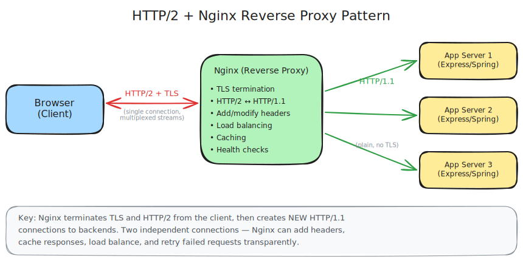
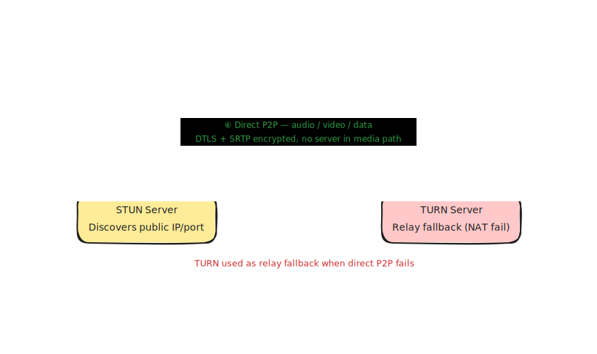
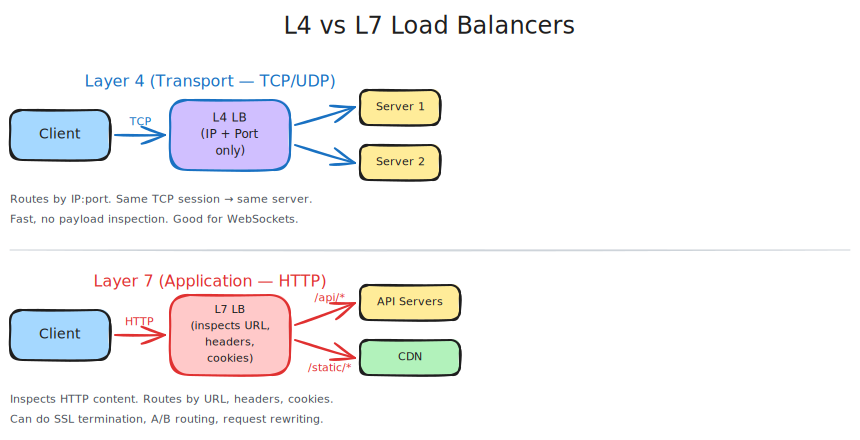

## Networking Protocols

### HTTP (HyperText Transfer Protocol)

- The foundation of data communication on the web.
- **HTTP/1.1**: One request per TCP connection (or keep-alive for reuse). Head-of-line blocking is a problem.
- **HTTP/2**: Multiplexing — multiple requests over a single TCP connection. Header compression (HPACK). Still has TCP-level head-of-line blocking.
- **HTTP/3**: Built on QUIC (UDP-based). Eliminates TCP head-of-line blocking. Faster connection setup.

### HTTP/2 + Nginx Reverse Proxy Pattern

In practice, HTTP/2 is used on the internet-facing edge while backends speak HTTP/1.1. A reverse proxy like Nginx sits in between — it terminates TLS and HTTP/2 from the client, then creates new HTTP/1.1 connections to backend servers. This gives you multiplexing benefits for clients while keeping backend infrastructure simple.

The proxy can add/modify headers, cache responses, load balance, and retry failed requests — all transparently to both sides.

---

## WebSockets

A full-duplex, persistent, bidirectional communication channel over a single TCP connection.

### How it works
1. Client initiates an HTTP handshake with an `Upgrade: websocket` header.
2. Server responds with `101 Switching Protocols`.
3. Both sides can now send messages freely at any time without re-establishing the connection.

### Characteristics
- **Bidirectional**: Both client and server can push messages independently.
- **Low latency**: No HTTP overhead after the initial handshake.
- **Stateful**: The connection is long-lived and maintained.
- **Protocol**: `ws://` or `wss://` (secure).

### When to use WebSockets
- Real-time, interactive applications where both sides need to send data frequently.
- Examples:
  - Chat applications (e.g., Slack, WhatsApp Web)
  - Multiplayer online games
  - Collaborative editing (e.g., Google Docs live cursors)
  - Live trading dashboards (stock prices with user interactions)
  - Live sports scoreboards with user interactions

### Drawbacks
- More complex to scale horizontally — sticky sessions or a pub/sub layer (e.g., Redis) needed.
- Not ideal if only the server needs to push data (SSE is simpler for that).
- Firewalls/proxies may block WebSocket upgrades.

---

## Server-Sent Events (SSE)

A unidirectional, server-to-client streaming mechanism over a standard HTTP connection.

### How it works
1. Client makes a regular HTTP GET request with `Accept: text/event-stream`.
2. Server keeps the connection open and streams events as `data: ...\n\n` formatted text.
3. Client receives events via the `EventSource` API in the browser.
4. If the connection drops, the browser automatically reconnects.

### Characteristics
- **Unidirectional**: Only server → client.
- **Built on HTTP**: Works over HTTP/1.1 and HTTP/2. No special protocol upgrade needed.
- **Auto-reconnect**: Browser `EventSource` handles reconnection automatically with `Last-Event-ID`.
- **Text-based**: Events are UTF-8 text. Binary data requires encoding (e.g., base64).

### When to use SSE
- Server needs to push updates to the client, but the client doesn't need to send data back frequently.
- Examples:
  - Live news feeds or social media timelines
  - Notification systems
  - Progress updates for long-running jobs (e.g., file upload processing)
  - Live dashboards (metrics, monitoring) where the client only reads
  - AI/LLM streaming responses (e.g., ChatGPT token-by-token output)

### Drawbacks
- Unidirectional — client must use separate HTTP requests to send data back.
- Limited to ~6 concurrent connections per domain in HTTP/1.1 (not an issue with HTTP/2).
- Text-only by default.

---

## Long Polling

A technique to simulate server push over plain HTTP before WebSockets/SSE were widely supported.

### How it works
1. Client sends an HTTP request.
2. Server holds the request open until it has new data (or a timeout occurs).
3. Server responds, client immediately sends another request.

### When to use Long Polling
- Legacy systems or environments where WebSockets/SSE are not supported.
- Low-frequency updates where the overhead of a persistent connection isn't justified.

### Drawbacks
- Higher latency than WebSockets or SSE.
- More server resource usage (holding open connections).
- Largely superseded by SSE and WebSockets.

---

## WebRTC (Web Real-Time Communication)

A protocol and API standard that enables **direct peer-to-peer** communication between browsers (or native clients) — for audio, video, and arbitrary data — without needing a server to relay the media.

### How it works
Connection setup is the complex part. Two peers can't just connect directly because they're usually behind NATs and firewalls. The process:

1. **Signaling** — peers exchange session descriptions (SDP: what codecs, formats they support) and network candidates via a signaling server. This is typically done over WebSockets.
2. **ICE (Interactive Connectivity Establishment)** — each peer gathers its possible network addresses (candidates) and they try to find a path to each other.
3. **STUN** — a lightweight server that tells a peer its public IP/port as seen from the outside. Used to attempt a direct connection.
4. **TURN** — a relay server used as a fallback when a direct connection can't be established (e.g., symmetric NATs). Media flows through TURN, so it's more expensive.
5. Once connected, media/data flows **directly peer-to-peer**, bypassing the server entirely.

### Key components
- **MediaStream** — captures audio/video from camera/mic.
- **RTCPeerConnection** — manages the peer connection, codec negotiation, and media transmission.
- **RTCDataChannel** — sends arbitrary data (text, binary) directly between peers. Can be configured as reliable (like TCP) or unreliable (like UDP).

### Characteristics
- **Peer-to-peer**: After signaling, no server is in the media path.
- **UDP-based**: Lower latency, tolerates some packet loss (acceptable for video/audio).
- **Encryption mandatory**: All streams are encrypted via DTLS and SRTP.
- **Complex setup**: ICE/STUN/TURN negotiation is significantly more involved than WebSockets.

### When to use WebRTC
- Any use case requiring real-time audio or video between users.
- Examples:
  - Video/voice calling (e.g., Google Meet, Zoom web client)
  - Screen sharing
  - P2P file transfer between browsers
  - Low-latency multiplayer games requiring direct peer connections

### Drawbacks
- Complex to implement — ICE negotiation, STUN/TURN infrastructure, SDP handling.
- TURN servers are needed as fallback and can be costly at scale (media flows through them).
- Doesn't scale well for group calls in pure P2P mesh — 10 participants means each peer maintains 9 connections. SFU (Selective Forwarding Unit) servers are used to solve this.
- ~95% browser support (slightly less than WebSockets).

### WebRTC + WebSockets together
WebRTC needs a signaling channel to bootstrap the peer connection — WebSockets are the standard choice for this. So in a video calling app:
- **WebSockets** handle signaling (SDP exchange, ICE candidates, chat messages, presence)
- **WebRTC** handles the actual audio/video/data once the peer connection is established

---

## Comparison: WebSockets vs SSE vs Long Polling

| Feature | WebSockets | SSE | Long Polling |
|---|---|---|---|
| Direction | Bidirectional | Server → Client only | Server → Client (simulated) |
| Protocol | `ws://` / `wss://` | HTTP | HTTP |
| Latency | Very low | Low | Medium |
| Auto-reconnect | Manual | Built-in | Manual |
| Browser support | Excellent | Excellent | Universal |
| Complexity | Higher | Low | Low |
| Binary support | Yes | No (text only) | No |
| HTTP/2 compatible | Yes | Yes (multiplexed) | Yes |
| Best for | Real-time interactive apps | Server push / streaming | Legacy / low-frequency updates |

---

## When to Use What

| Scenario | Recommended |
|---|---|
| Chat / messaging app | WebSockets |
| Multiplayer game | WebSockets |
| Collaborative editing | WebSockets |
| Live notifications | SSE |
| LLM streaming output | SSE |
| Progress bar for background job | SSE |
| Live metrics dashboard (read-only) | SSE |
| Legacy browser support needed | Long Polling |
| Client sends data frequently too | WebSockets |
| Video/voice calling | WebRTC |
| P2P file transfer | WebRTC |
| Screen sharing | WebRTC |

---

## Load Balancing

Load balancing distributes incoming traffic across multiple servers. Two broad approaches: **client-side** and **dedicated (server-side)**.

---

### Client-Side Load Balancing

The client itself decides which server to talk to. It fetches a list of available servers from a **service registry** and picks one directly — no intermediary hop needed.

**How it works:**
1. Client queries a service registry (or gets pushed updates) to get the current list of healthy servers.
2. Client applies a selection algorithm (round-robin, least connections, etc.) locally.
3. Client connects directly to the chosen server.
4. Client periodically refreshes the server list.

**Advantages:**
- No extra network hop on every request — faster than routing through a dedicated LB.
- The client can pick the fastest/closest server based on real-time knowledge.

**Disadvantages:**
- Updates are eventually consistent — if a server goes down, clients may still try it until they refresh.
- Requires clients to implement the selection logic. Works best when you control the clients.

#### Example: Redis Cluster
Redis Cluster is a textbook example of client-side load balancing. Each Redis node participates in a gossip protocol — every node knows about every other node and which key slots (shards) it owns.

When a Redis client connects, it fetches the cluster topology (node list + shard map) from any node. On each read/write, the client hashes the key to determine the correct shard and talks directly to the right node — no proxy in the middle. If you hit the wrong node, Redis returns a `MOVED` redirect and the client updates its local map.

#### Example: DNS Round-Robin
DNS is a form of client-side load balancing. A domain like `api.example.com` can resolve to multiple IP addresses. The DNS server rotates the order of IPs returned, so different clients hit different servers.

This is also how you avoid a single point of failure with a dedicated load balancer: run two load balancers in different data centers and use DNS to rotate between them. If one goes down, clients automatically try the other.

**Limitation:** DNS has TTL-based caching. Updates (adding/removing servers) propagate slowly — as slow as the TTL (often minutes to hours). Not suitable when you need fast failover.

#### Example: gRPC Client-Side Load Balancing
gRPC has client-side load balancing built in for internal service-to-service communication. The gRPC client resolves the service name to a list of backend addresses (via DNS or a service registry like Consul/etcd) and distributes RPCs across them using a configurable policy (round-robin by default). This is why gRPC is efficient for microservices — no extra hop to a proxy on every call.

#### When to use client-side load balancing
- Internal microservices where you control the clients (gRPC is the canonical case).
- When you need to minimize per-request latency and can tolerate slightly stale server lists.
- DNS round-robin for coarse-grained distribution across load balancers or regions.

---

### Dedicated Load Balancers

A dedicated load balancer sits between clients and backend servers. Clients talk to the LB; the LB forwards to a backend. Clients don't know about individual servers.

**Advantages:**
- Instant updates — add/remove servers without waiting for clients to refresh.
- Fine-grained routing control.
- Health checking and automatic failover built in.

**Disadvantage:** Extra network hop on every request.

#### Layer 4 (L4) Load Balancers

Operate at the **transport layer** (TCP/UDP). Route based on IP address and port only — they don't inspect the payload.

- Maintain persistent TCP connections between client and server.
- Very fast — minimal packet inspection.
- Cannot route based on URL, headers, or cookies.
- The same backend server handles all requests within a TCP session.

**Best for:** WebSocket connections (persistent TCP), high-throughput raw TCP/UDP traffic, protocols that require connection affinity.

#### Layer 7 (L7) Load Balancers

Operate at the **application layer** (HTTP). Inspect the actual request content and make intelligent routing decisions.

- Terminate the incoming connection and open a new one to the backend.
- Can route based on URL path, headers, cookies, query params.
- More CPU-intensive due to packet inspection.
- Can do SSL termination, request rewriting, A/B routing.

**Best for:** HTTP/HTTPS traffic, API gateways, routing different paths to different services (e.g., `/api/*` → API servers, `/static/*` → CDN).

**L4 vs L7 in interviews:** If you're using WebSockets, mention L4. For everything HTTP-based (REST, SSE, long polling), L7 is the default.

#### Load Balancing Algorithms

| Algorithm | How it works | Best for |
|---|---|---|
| Round Robin | Rotate through servers sequentially | Stateless, uniform request cost |
| Random | Pick a random server | Similar to round robin, simpler |
| Least Connections | Send to server with fewest active connections | Long-lived connections (WebSockets, SSE) |
| Least Response Time | Send to fastest-responding server | Heterogeneous servers |
| IP Hash | Hash client IP → consistent server | Session stickiness (use sparingly) |

For stateless HTTP services, round-robin or random is fine. For persistent connections (WebSockets, SSE), **least connections** prevents one server from accumulating all the long-lived connections while others sit idle.

#### Health Checks

Load balancers continuously probe backends to detect failures:
- **L4 health check**: Can the server accept a TCP connection?
- **L7 health check**: Does `GET /health` return HTTP 200?

When a server fails health checks, the LB stops routing to it. When it recovers, it's added back automatically. This is the core of high availability — failures are handled without human intervention.

Reference: [hellointerview.com — Networking Essentials](https://www.hellointerview.com/learn/system-design/core-concepts/networking-essentials)
